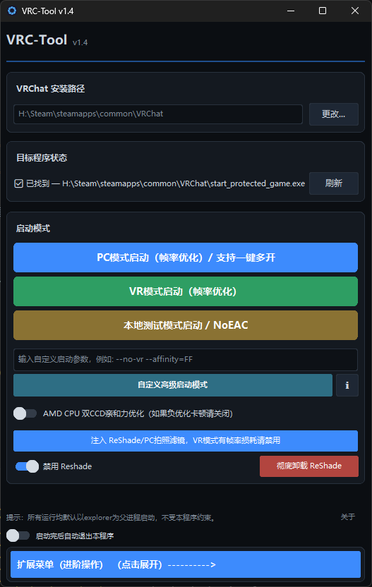
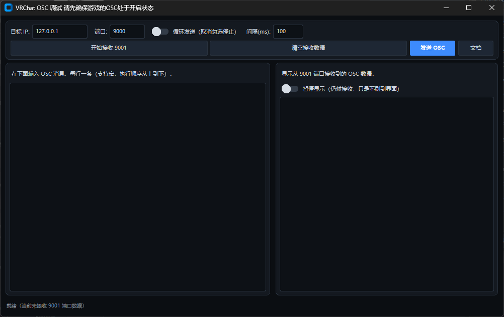
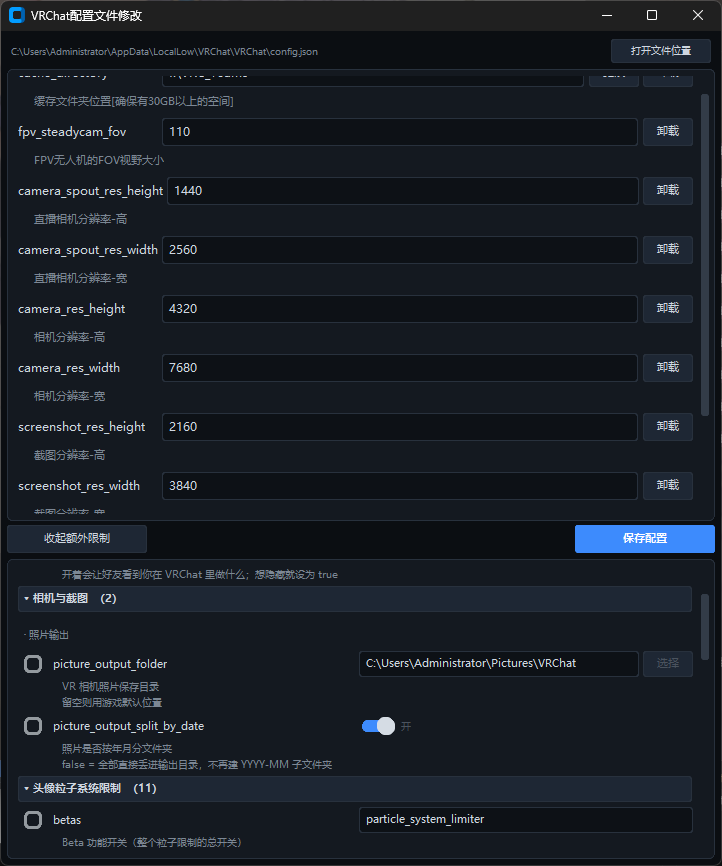

# VRChat-Tool / VRC-Tool
VRChat优化工具箱 / VRChat reshade / VRChat Tool

## 内容物
基础启动项编辑器,
cfg配置文件编辑器,
OSC调试器,
Reshade安装器

# 程序亦在~~帮助简化使用高级启动项~~，现已面向多功能辅助性工具箱

LLM提醒
请注意，项目中使用了大量AI代码，AI内容约占比项目70%

源代码未提供Reshade支持，如果需要自行安装或者从Releases下载打包二进制文件

----------------------------------------------------------
# 参考视频：https://www.bilibili.com/video/BV16mTu62EG5

有关VRC高级启动项参考：https://docs.vrchat.com/docs/launch-options

有关VRC OSC使用参考：https://github.com/VolcanicArts/VRCOSC

有关Unity高级启动项参考：https://docs.unity3d.com/2022.3/Documentation/Manual/PlayerCommandLineArguments.html

# 如何构建

解压项目到文件夹，在当前文件夹中管理员身份运行CMD执行

py -m PyInstaller VRChatFixTool.spec

命令即可（需要python3.0以上的环境，并且安装PyInstaller库）

运行后的产物存放在dist文件夹当中

# 其他参考

UI设计参考：https://github.com/TomSchimansky/CustomTkinter

Reshade：https://reshade.me/

Reshade Github：https://github.com/crosire/reshade
